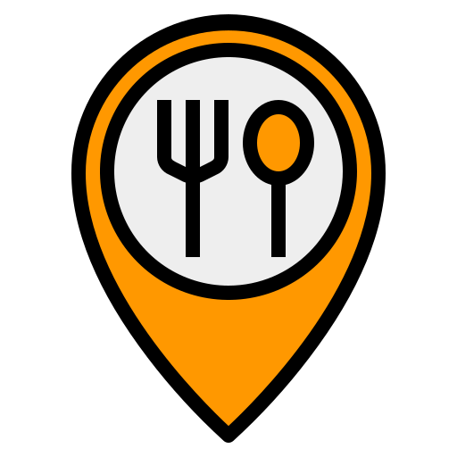
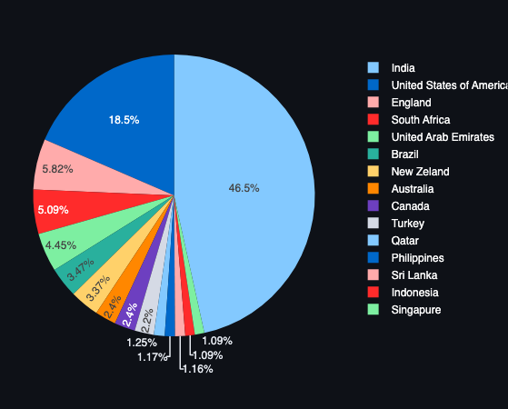
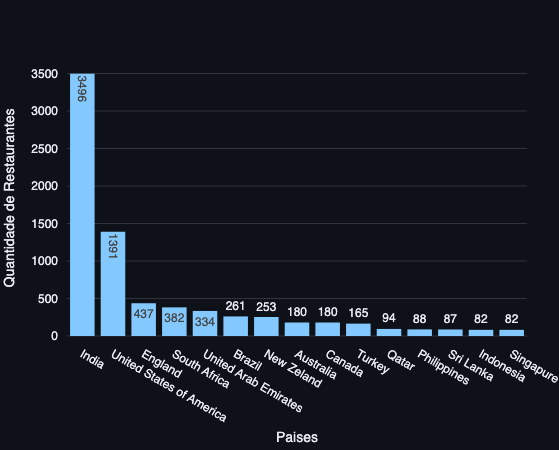

# 1.Introducao e o problema de negocio

A pinPop é um marketplace ficticio de restaurantes, onde atraves de um aplicativo conecta restaurantes, entregadores e clientes.

Os restaurantes fazem o cadastro dentro da plataforma do pinPop, que disponibiliza informações como endereço, tipo de culinária servida, se possui reservas, se faz entregas e também uma nota de avaliação dos serviços e produtos do restaurante, dentre outras informações.

Esse projeto buscou apresentar um conjunto de graficos e dados que permita tomadas de decisoes estrategicas com o escopo de alavancar o pinPop:

1. Realizou a analise exploratoria de dados dos restaurantes registrados dentro da plataforma;
2. Desenvolvou um dashboard online que possa ser acessado e permita aplicacao de filtros de atributos e uma visualização de localizacao geografica dos restaurantes, dados por cidade, pais, tipo de culinaria, avaliacao e custo. 
   

# 2.Premissas

Algumas premissas foram assumidas:
1. Desconsiderradas informacoes nulas ou vazias.
2. Foram consideradas apenas o principal tipo culinario de cada restaurante e para tanto, foi considerado como principal tipo culinario, o primeiro tipo cadastrado.
3. Considerou-se como criterio de desempate a coluna 'restaurante_id', considerando que o id de menor valor conrresponderia ao restaurante mais antigo cadastrado no aplicativo.

# 3.Planejamento da solucao:
### 3.1.Entrega
1. Painel online, hospedado em nuvem com a apresentação geral dos dados, podendo ser acessado atraves do link: [title](https://lununespires-world-restaurants-home-hvl5xm.streamlit.app/)

### 3.2.Ferramentas
- Python 3.9
- Jupyter notebook
- Streamlit

### 3.3.Processo
Para responder as questões de negócio, os dados foram coletados, processados, transformados, limpos e explorados.
A partir dai os dados foram agrupados e demonstrados, sendo divididos em:
- Visao dos Paises
- Visao das Cidades
- Visao da Culinaria

# 4.Principais insights
- O pinPop atualmente encontra-se em 15 paises, sendo que a India e os Estados Unidos da America sao seus dois maiores mercados, com 46.5 % e 18.5% dos restaurantes cadastrados.
- Que apesar da Inglaterra ser o terceiro mercado do pinPop com com apenas 5.82% dos restaurantes cadastrados, e os Emirados Arabes com 4.45% ocupando o quinto lugar, se excluirmos a India (por sozinha ter 46.5%), ambas concentram um consideravel numero de restaurante cadastrados por cidade.
- Que, excluindo a India, os melhores restaurantes, segundo avaliacao dos clientes, concentra-se nos Emirados Arabes, Turquia e Inglaterra.  
  

# 5.Conclusao
O projeto foi capaz de aprensentar de forma clara o cenario do pinPop atraves de graficos e/ou tabelas que exibem a realidade no periodo compreendido quando da coleta de dados, propiciando ao CEO da empresa uma visao ampla e analitica para tomadas de decisao.

# 6.Proximos Passos
- ajustar as quantidade de metricas e graficos.
- definir uma moeda de conversao para que os valores das refeicoes para duas pessoas sejam consideradas e analisadas.
